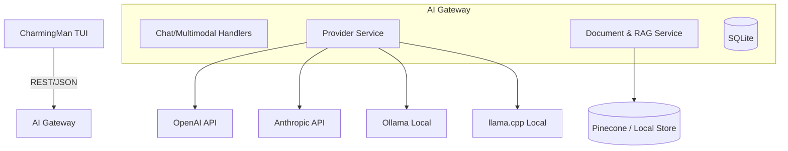

# CharmingMan AI Gateway

The AI Gateway is the central intelligence hub of CharmingMan. It provides a unified abstraction layer for various Large Language Model (LLM) providers, handling authentication, routing, retrieval-augmented generation (RAG), and multimodal processing.

## 🏗️ Architecture

The gateway is built with Go and Gin, utilizing the `fantasy` library for provider abstraction. It acts as a middleware between the ChatTUI and multiple AI backends.

## 🔌 Provider Abstraction

CharmingMan abstracts differences between LLM providers, allowing you to switch between them seamlessly or mix and match them within the same multi-agent session.

| Provider | ID | Description |
|----------|----|-------------|
| **OpenAI** | `openai` | Supports GPT-4o, GPT-3.5-Turbo, Whisper STT, and TTS. |
| **Anthropic** | `anthropic` | Supports the Claude 3.5 Sonnet and Haiku models. |
| **Ollama** | `ollama` | Local LLM hosting (defaults to `localhost:11434`). |
| **llama.cpp** | `llamacpp` | Direct GGUF model serving via llama.cpp server. |

## ⚙️ Configuration

The gateway is configured via environment variables, typically stored in a `.env` file in the `backend/` directory.

### Core Settings
- `PORT`: Port to listen on (default: `8090`).
- `GATEWAY_API_KEY`: Secret key for authenticating TUI requests (Header: `X-Charming-Key`).
- `DATA_DIR`: Directory for the SQLite database (default: `.`).

### Provider Keys
- `OPENAI_API_KEY`: Required for OpenAI models, Whisper STT, and RAG embeddings.
- `ANTHROPIC_API_KEY`: Required for Claude models.
- `OLLAMA_BASE_URL`: URL for local Ollama instance (e.g., `http://localhost:11434`).
- `LLAMACPP_BASE_URL`: URL for llama.cpp server.

### Knowledge & RAG
- `DOCUMENTS_ROOT`: Path where documents are stored for indexing (default: `./documents`).
- `PINECONE_API_KEY`: Optional; for managed vector storage.
- `PINECONE_INDEX`: Optional; name of the Pinecone index.

## 🛣️ Unified Endpoints

All endpoints are prefixed with `/api/v1`.

### Chat & Agents
- `POST /chat`: Primary endpoint for LLM interaction. Supports `provider`, `model`, `prompt`, `use_rag`, and `room_id`.
- `GET /agents`: List all configured agent personas.
- `POST /agents`: Create or update an agent definition.

### Knowledge (RAG)
- `POST /documents`: Index a local file (PDF, MD, TXT).
- `GET /search`: Perform semantic search across indexed documents.

### Multimodal
- `POST /transcribe`: Convert audio (WAV/MP3) to text using Whisper.
- `POST /speech`: Convert text to audio (MP3) using OpenAI TTS.

### Infrastructure
- `GET /usage`: Retrieve token usage logs and aggregate statistics.
- `GET /tools`: List active Model Context Protocol (MCP) tools.

## 🔒 Security & Resilience

- **API Key Protection**: If `GATEWAY_API_KEY` is set, all requests must include the `X-Charming-Key` header.
- **Log Redaction**: Prompt content is redacted in the database usage logs to protect privacy.
- **Bounded History**: Chat history retrieval is capped at the last 10 messages per room to optimize performance and prevent token overflow.
- **Path Validation**: Strict checks on file paths for document ingestion to prevent path-traversal attacks.
